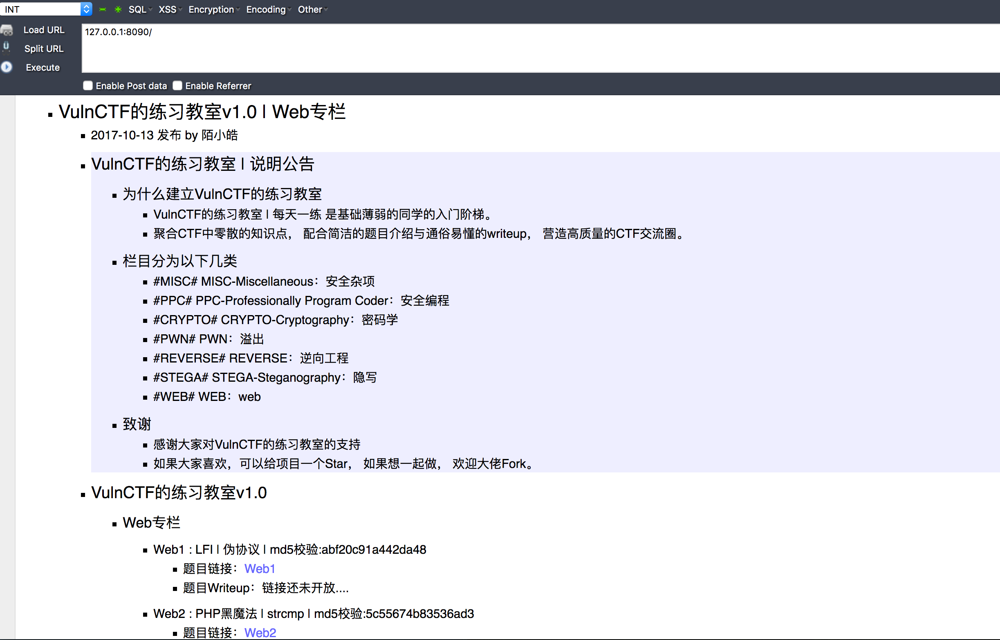

# MiniProject_VulnCTF | A CTF practice environment that links Dockerhub through Github

VulnCTF是面向所有练习CTF的朋友的环境入门阶梯，聚合并收集CTF中零散的知识点，使用简单的Docker命令就可以搭建出CTF练习平台，配合简洁的题目介绍与通俗易懂的Writeup，营造高质量的CTF交流圈。 

## 0x01 Installation

```Reference documents
Mac : [官方手册](https://docs.docker.com/docker-for-mac/install/)
Ubuntu : [官方手册](https://docs.docker.com/install/linux/docker-ce/ubuntu/)
Centos : [官方手册](https://docs.docker.com/install/linux/docker-ce/centos/)
```

## 0x02 Topic classification 

*   MISC-Miscellaneous：安全杂项
*   PPC-Professionally Program Coder：安全编程
*   CRYPTO-Cryptography：密码学
*   PWN：溢出
*   REVERSE：逆向工程 
*   STEGA-Steganography：隐写 
*   WEB：[Web](./Web)

## 0x03 Start environment

* 1.拉取环境【以Web题目为例】
```     
docker pull vulnctf/web
```
* 2.启动环境
```
docker run -d -p 8090:80 vulnctf/web:latest
```
* 3.访问IP：8090【如下图所示】


### 0x04 Precautions

*   本项目中的所有示例代码来源于各CTF平台或者改编。
*   本项目中的所有示例代码不可作为生产环境使用，仅供测试和学习。
*   本项目中的所有的CTF解题思路都在圈子【VulnCTF的练习教室】中，暂不提供公开，如果有兴趣交流，可以加入圈子，入圈费用会作为我们租服务器以及其他后续发展需要，不过强烈要求入圈人员要有CTF基础，感谢支持。
*   欢迎各位表哥或小伙伴有好的想法或者题目与我进行交流，联系方式：123398772@qq.com。
*   如果大家喜欢，可以给项目一个Star， 如果想一起做， 欢迎大佬Fork。

