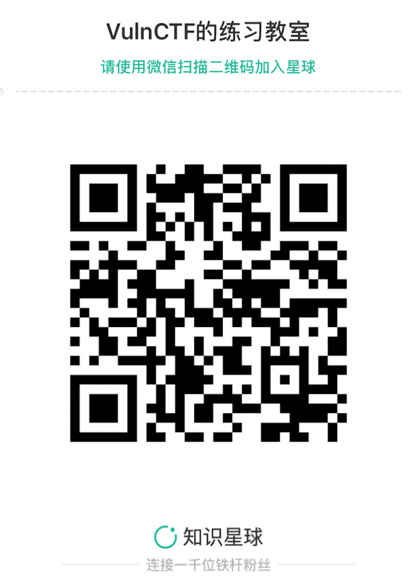

# VulnCTF | Web
* Web1 : LFI      | 伪协议      | md5校验:abf20c91a442da48
* Web2 : PHP黑魔法 | strcmp     | md5校验:5c55674b83536ad3
* Web3 : PHP黑魔法 | 弱类型==|===比较  | md5校验:9630e9ba0442fa3a
* Web4 : PHP优先级 | 绕过and后面的is_numeric() | md5校验:c569d1f25f24fc39
* Web5 : PHP黑魔法 | ereg()截断 | md5校验:de1dd7a18864371c
* Web6 : PHP弱类型 | 绕过$a==0 | md5校验:c9bf52aa72e0299b
* Web7 : PHP黑魔法 | 伪协议绕过file_get_contents() | md5校验:4ca0e6cc62cd6a0a

# VulnCTF

## MiniProject_VulnCTF | CTF 每日一练

### 0x00 前言
* CTFhub是面向所有学习CTF的朋友的环境，不用了解docker原理及知识，仅仅简单执行几条命令即可完成整个平台的搭建。

### 0x01 搭建环境
* VulnCTF是基础薄弱的同学的入门阶梯。 聚合并收集CTF中零散的知识点，使用简单的Docker命令就可以搭建出CTF练习平台，配合简洁的题目介绍与通俗易懂的Writeup，营造高质量的CTF交流圈。 

### 0x02 栏目分为以下几类： 
* MISC-Miscellaneous：安全杂项
* PPC-Professionally Program Coder：安全编程
* CRYPTO-Cryptography：密码学
* PWN：溢出
* REVERSE：逆向工程 
* STEGA-Steganography：隐写 
* WEB：web

### 0x03 启动环境

* 1.拉取环境【以Web题目为例】
*     docker pull vulnctf/web
* 2.启动环境
*     docker run -d -p 8090:80 vulnctf/web:latest
* 3.访问IP：8090【如下图所示】

### 0x04 注意事项
* 本项目中的所有示例代码来源于各CTF平台或者改编。
* 本项目中的所有示例代码不可作为生产环境使用，仅供测试和学习。
* 本项目中的所有的CTF解题思路都在圈子【VulnCTF的练习教室】中，暂不提供公开，如果有兴趣交流，可以加入圈子，入圈费用会作为我们租服务器以及其他后续发展需要，不过强烈要求入圈人员要有CTF基础，感谢支持。

* 欢迎各位表哥或小伙伴有好的想法或者题目与我进行交流，联系方式：123398772@qq.com。
* 如果大家喜欢，可以给项目一个Star， 如果想一起做， 欢迎大佬Fork。
